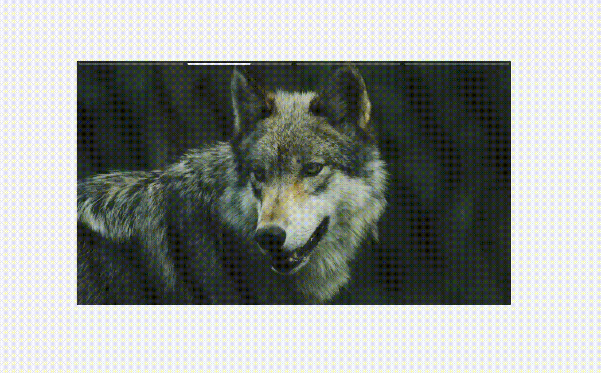

# 📱 SlideStories

Um componente de **Stories inspirado na experiência do Instagram**, desenvolvido com **TypeScript, HTML e CSS**, permitindo navegar entre imagens e vídeos com reprodução automática, barra de progresso e controle de pausa.

O projeto foi desenvolvido com foco em praticar **Programação Orientada a Objetos, manipulação do DOM, gerenciamento de tempo e eventos de interação do usuário**.



## ✨ Demonstração

O SlideStories apresenta uma sequência de imagens e vídeos que são exibidos automaticamente, simulando a experiência de visualização de Stories.

Cada slide possui uma **barra de progresso individual**, indicando o tempo restante para a troca automática do conteúdo.

### Funcionalidades

* ▶️ Reprodução automática dos slides
* ⏱️ Barra de progresso indicando o tempo de visualização
* ⏸️ Pausar a reprodução ao pressionar o conteúdo
* ▶️ Continuar a reprodução após soltar
* ⬅️ Voltar para o slide anterior
* ➡️ Avançar para o próximo slide
* 🔄 Navegação circular entre os slides
* 🎥 Suporte para imagens e vídeos
* 🔇 Reprodução automática de vídeos com áudio desativado
* 💾 Persistência do slide atual utilizando `localStorage`
* 📱 Suporte a interações com mouse e dispositivos touch

## 🛠️ Tecnologias utilizadas

* **TypeScript**
* **HTML5**
* **CSS3**
* **Vite**
* **JavaScript DOM API**
* **HTML5 Video API**
* **LocalStorage API**

## 🧠 Conceitos praticados

Este projeto foi desenvolvido para colocar em prática alguns conceitos importantes do desenvolvimento Front-end:

### Programação Orientada a Objetos

A lógica principal do slider foi organizada através da classe `Slide`, responsável por controlar:

* estado atual do slider;
* navegação entre slides;
* reprodução automática;
* controles;
* barra de progresso;
* pausa e continuação;
* reprodução de vídeos.

Também foi criada uma classe `Timeout`, responsável pelo controle do temporizador utilizado durante a reprodução automática.

### Gerenciamento de tempo

O projeto possui um controle próprio de `setTimeout`, permitindo **pausar e continuar o temporizador mantendo o tempo restante**.

Isso evita que o tempo de visualização seja reiniciado ao pausar um slide.

### Manipulação do DOM

Os elementos de controle e as barras de progresso são criados dinamicamente utilizando a API do DOM.

### Eventos

Foram utilizados eventos como:

* `pointerdown`
* `pointerup`
* `touchend`
* `playing`

para controlar a interação do usuário e a reprodução dos conteúdos.

### Vídeos

Quando o slide atual é um vídeo, sua duração é utilizada automaticamente para determinar o tempo de exibição daquele slide.

Dessa forma, a barra de progresso acompanha a duração real do vídeo.

### Persistência de estado

O índice do slide atual é armazenado no `localStorage`, permitindo recuperar a posição em que o usuário estava ao recarregar a página.

## ⚙️ Como executar

### 1. Clone o repositório

```bash
git clone https://github.com/giosantos99/SlideStories.git
```

### 2. Acesse a pasta

```bash
cd SlideStories
```

### 3. Instale as dependências

```bash
npm install
```

### 4. Execute o projeto

```bash
npm run dev
```

O Vite disponibilizará o projeto localmente.

## 🎮 Como utilizar

O slider pode ser inicializado informando o elemento principal, os slides, o container dos controles e o tempo de exibição:

```typescript
const slide = new Slide(
  container,
  Array.from(elements.children),
  controls,
  3000
)
```

O último parâmetro define o tempo de exibição das imagens em milissegundos.

No caso dos vídeos, a duração é obtida automaticamente através da propriedade `duration`.

## 📌 Possíveis melhorias

Algumas funcionalidades que podem ser adicionadas futuramente:

* Gestos de swipe para navegação em dispositivos móveis
* Animações de transição entre os slides
* Indicador visual de slide selecionado
* Acessibilidade aprimorada para navegação por teclado
* Botão para ativar/desativar áudio dos vídeos
* Suporte a múltiplas instâncias do componente na mesma página
* Transformar o slider em um componente reutilizável

## 🎯 Objetivo do projeto

O objetivo do SlideStories foi desenvolver um componente inspirado em uma funcionalidade conhecida de aplicações modernas e, a partir dela, praticar conceitos fundamentais de Front-end, como **TypeScript, orientação a objetos, eventos, manipulação do DOM, gerenciamento de estado e controle assíncrono de tempo**.

## 👩‍💻 Desenvolvido por

**Giovanna Santos de Souza**

Desenvolvedora Front-end com experiência em **Vue.js, Quasar e JavaScript**, atualmente aprofundando os conhecimentos em TypeScript e desenvolvimento de interfaces modernas.

[GitHub](https://github.com/giosantos99)
